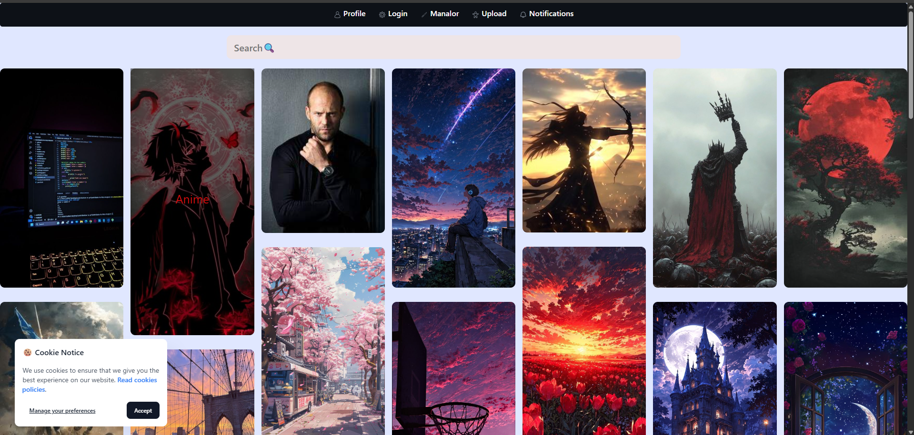
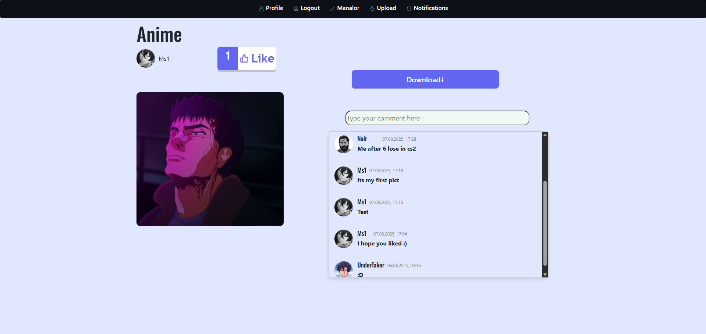
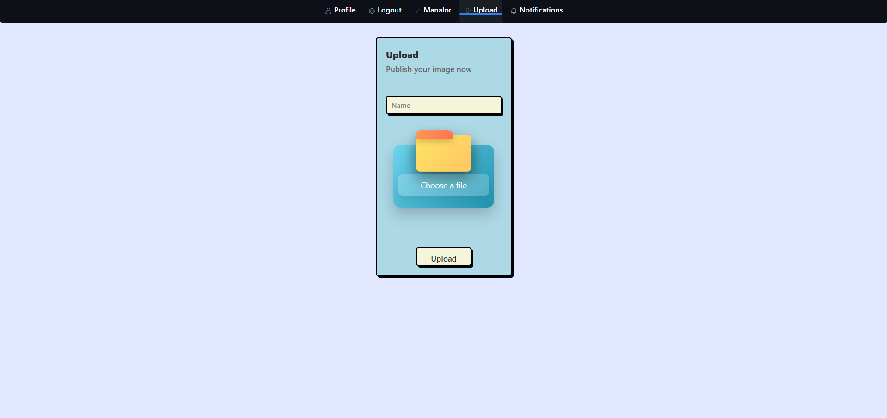

# Manlor

**Manlor is a social network for sharing photos.  
Users can upload images, interact with posts, and download photos.**

## Features

- User registration
- User authentication
- Photo upload
- Like photos
- Comment on photos
- Download photos

## Tech Stack

- Backend: ASP.NET Core Web API (.NET)
- Database: MSSQL/Entity Framework
- Frontend: React

## Description

Manlor allows users to create an account, upload photos, and interact with other users through likes and comments.  
The platform is focused on simplicity and user interaction.

## Status

The project is under development.
